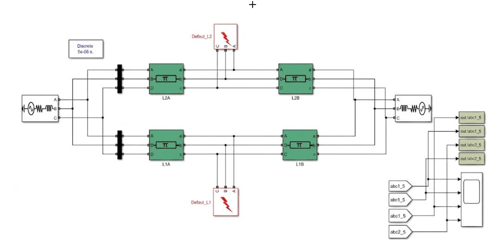

# Fault Detection, Classification and Localization in a 400 kV Double-Circuit Transmission Line

## Project Overview

This Final-Year Engineering Project presents an intelligent protection approach for **fault detection, classification, and localization** in a **400 kV, 50 Hz, 100 km double-circuit transmission line**.

The system was developed in **MATLAB/Simulink** using **Artificial Neural Networks (ANNs)**. It uses electrical measurements from the two three-phase circuits and addresses the additional complexity caused by **mutual electromagnetic coupling** between the circuits.

## Integrated Protection System

The three trained ANN models are integrated into a unified MATLAB/Simulink protection system:

**RMS Signal Processing → Fault Detector → Fault Classifier → Fault Localizer**

## System Specifications

| Parameter | Value |
|---|---|
| Voltage level | 400 kV |
| Frequency | 50 Hz |
| Line length | 100 km |
| Configuration | Double circuit, three-phase |
| Simulation | MATLAB / Simulink |
| AI technique | Artificial Neural Networks |
| Simulation scenarios | 1,750 |

## Methodology

1. Model the 400 kV double-circuit transmission line.
2. Generate a database of fault scenarios with different fault types, locations, and fault resistances.
3. Acquire and process electrical voltage and current signals.
4. Calculate RMS quantities used as ANN inputs.
5. Train three ANN models for detection, classification, and localization.
6. Integrate the trained models into the Simulink protection system.
7. Validate the complete system on representative fault cases.

## ANN Models

| Model | Function | Architecture | Validation performance |
|---|---|---|---|
| **Fault Detector** | Detects a fault and identifies the affected circuit | 12-20-10-2 | MSE = 1.885 × 10⁻⁶, R = 1.000 |
| **Fault Classifier** | Identifies the fault type | 12-40-20-10 | MSE = 1.247 × 10⁻⁵, R = 0.99992 |
| **Fault Localizer** | Estimates the fault distance | 12-50-25-10-1 | MSE = 0.317 km², R = 0.99978 |

The integrated system was evaluated on representative fault cases. The **majority of localization errors were below 1 km**, with larger errors occurring in some high-impedance fault cases.

## Fault Categories

The classifier covers ten fault categories:

**AG, BG, CG, AB, BC, AC, ABG, BCG, ACG, ABC**

## Project Files

- [MATLAB/Simulink Model](PFE_2Lignes_RNA%20%282%29.slx)
- [Fault Detector](RNA_Detecteur_100km%20%283%29.mat)
- [Fault Classifier](RNA_Classificateur_100km%20%283%29.mat)
- [Fault Localizer](RNA_Localisateur_100km%20%283%29.mat)

## Tools & Technologies

- MATLAB
- Simulink
- Artificial Neural Networks
- Electrical Power Systems
- Transmission Line Protection
- Fault Analysis
- Signal Processing

## Project Context

This project was carried out as a **Final-Year Engineering Project in Electrical Engineering – Electrical Networks**.

It combines **power-system modeling, transmission-line protection, electrical fault analysis, signal processing, and artificial intelligence**.

## Future Work

- Expand the simulation database and operating conditions.
- Improve localization accuracy for difficult fault cases.
- Evaluate robustness against measurement noise.
- Test additional transmission-line configurations.
- Investigate advanced machine-learning and deep-learning methods.

## Author

**Younes Ferkous**  
Electrical Engineering – Electrical Networks
